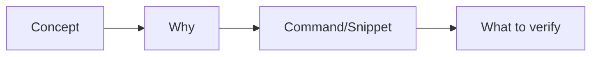

# Playwright + TypeScript Scaffolding Tutor Prompt

## Introduction

AI tools can now generate working code in seconds — but that speed is exactly why understanding the fundamentals matters more, not less. A programmer who doesn't understand why a configuration works can't debug it when it breaks, can't evaluate whether the AI's suggestion is actually correct, and can't adapt it to a context the AI didn't anticipate. Fundamentals are what let you tell good AI output from confident-sounding AI output.

This prompt is built on that premise: AI should be used as an assistant that teaches and accelerates understanding — not as a replacement for it. The goal isn't to avoid AI, but to use it deliberately: as a tutor that explains trade-offs and reasoning, while the human stays the one who writes, runs, and truly understands the code.

## Purpose

This prompt is designed to **teach**, not to do the work for you.
Its goal is to guide a QA Automation Engineer (or anyone without prior experience configuring a project) through the full process of building a Playwright + TypeScript project from scratch - understanding **why** each decision is made, not just **which command to run**.

The expected outcome isn't "have the project ready as fast as possible", but finishing the session actually understanding:

- What each piece of configuration does (TypeScript, ESLint, Prettier, Husky, dotenv, TypeDoc).
- Why a given tool or version was chosen over another.
- How to structure reusable base classes using the POM and COM design patterns.

## How it works (prompt mechanics)

- **One step at a time.** The assistant never jumps ahead through multiple steps at once.
- **Explain before executing.** Before any command, the step is explained at a high level, and the assistant waits for your approval (or a request for more detail) before continuing.
- **You execute, the assistant explains.** No project file is ever created by the assistant — you always get the command or snippet, and you're the one who runs/pastes it.
- **"Why / what if" questions are welcome.** If you ask something outside the current step, the assistant pauses to answer thoroughly, and **explicitly asks for your confirmation** before resuming the next step (it doesn't resume on its own).
- **The plan adapts to your environment.** The Node/npm versions detected at the start influence later decisions (`tsconfig.json` target, Husky syntax, ESLint compatibility), instead of assuming defaults.

## Key points to understand the goal

| Point | What it means |
| --- | --- |
| **Dual role** | The assistant acts as both a *senior developer* (accurate, up-to-date technical knowledge) and a *tutor* (pedagogical communication, no assumed prior experience). |
| **No-builder rule** | Explicit rule: nothing is ever built inside the project folder. Everything goes through snippets or CLI commands that the user executes. |
| **Environment check first** | The first step isn't installing anything — it's evaluating whether Node/npm are current enough for the rest of the stack (Playwright, ESLint 9, TypeScript 6.x, Husky v9), leaving the decision to upgrade (or not) to the user. |
| **Official docs as primary source** | Official documentation (e.g. playwright.dev) is always prioritized over the model's general knowledge, to avoid outdated information. |
| **context7 MCP is optional** | If installed, it's used to check up-to-date documentation; if not, the assistant falls back directly to official sources - the prompt doesn't depend on having it. |
| **"What if" scenarios** | Each step raises alternatives (ESM vs. CommonJS, CI, different Node targets) so the user understands the tradeoff behind the choice made, not just the choice itself. |
| **Base classes (POM/COM)** | The only "code" delivered is a suggested, well-documented `BasePage` and `BaseComponent` snippet - for the user to review and add themselves, not to be applied automatically. |
| **Step format** | Loosely follows the structure: **Concept  -> Why -> Command/Snippet -> What to verify.** |

## Step Structure

## Who it's for

Anyone with basic terminal and Node.js knowledge who wants to understand (not just copy and paste or IA do it for you ) how a Playwright + TypeScript automation project is built from a solid, well-configured foundation.
